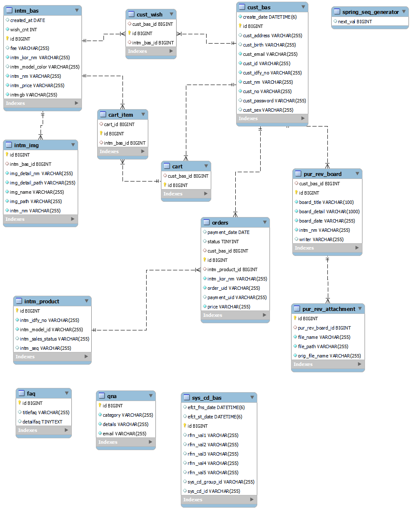
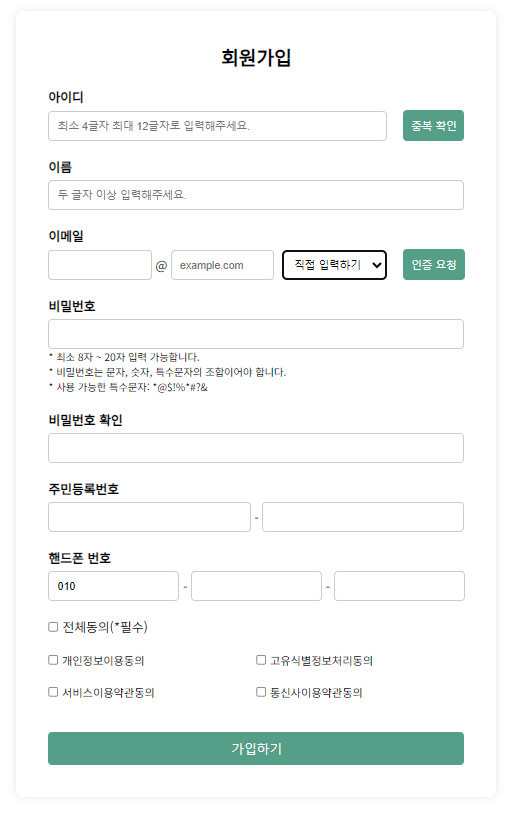
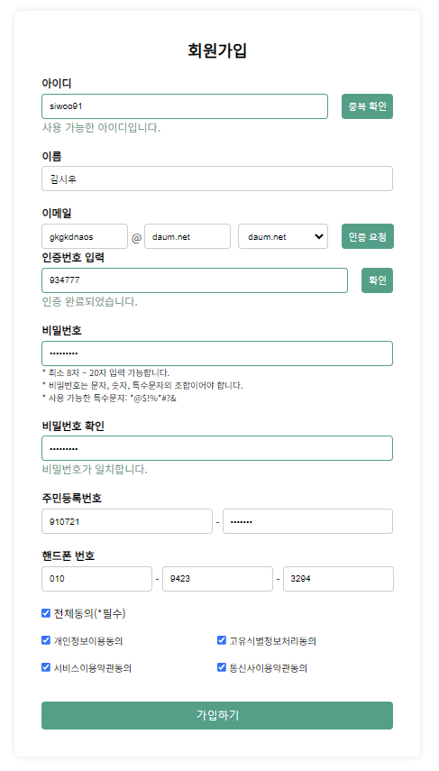
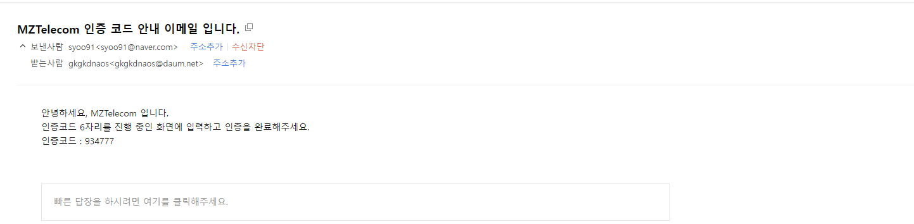
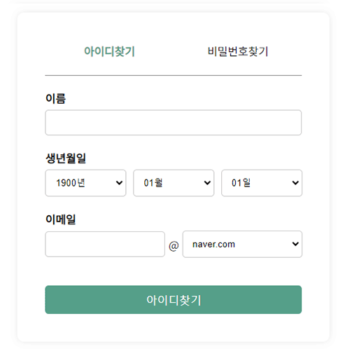
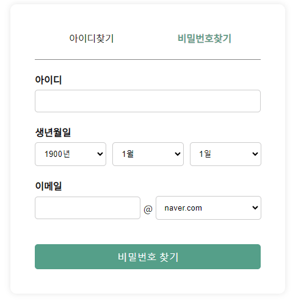

# 📱휴대폰 판매 사이트 "MZT"


> 배포 URL : http://13.209.19.247:8081/ <br>
> admin ID : admin <br>
> admin PW : !admin12

- header에 있는 사람 아이콘 클릭! <br>
→ user : 마이페이지 <br>
→ admin : 관리자 페이지

<br>

# 📚 목차

1. [프로젝트 소개](#프로젝트-소개)
2. [제작기간 및 참여인원](#제작기간-및-참여인원)
3. [ERD](#erd)
4. [화면 구성 & 기능](#화면-구성-&-기능)
5. [트러블 슈팅](#트러블-슈팅)
6. [프로젝트 후기](#프로젝트-후기)

<br>

# 📖 프로젝트 소개

"MZT"는 "MZ"와 "Telecom"의 조합으로, 
"MZ"는 현재 세대를 상징하며, "Telecom"은 통신 기술 용어입니다. 이 두 용어가 결합된 "MZT"는 현대적인 통신 기술과 세대를 반영하며, 이를 기반으로 혁신적인 서비스를 제공한다는 의미를 담고 있습니다.

최근까지 제 4의 이동통신사와 관련하여 많은 이야기들이 대두가 되었습니다. 현재도 제 4 이동통신사가 되기 위해 도전을 하고 있는 기업들을 볼 수 있는데, 이러한 상황들을 착안해서 프로젝트를 기획하게 되었습니다.

새로운 이동통신사가 생긴다면 기존의 이동통신사와 비교를 하면서 휴대기기 판매와 신규 이동통신사의 가입 등의 흐름을 이해 할 수 있도록 하기 위한 목적으로 제작 하였습니다.<br>

<br>

[목차🔺](#목차)
<br><br>

# 👋🏻 제작기간 및 참여인원

### FrontEnd
2023-11-13 ~ 2023-12-10
### BackEnd
2023-12-18 ~ 2023-02-12
### 참여인원
팀 프로젝트 (총 3명)<br>

<table>
  <tr>
    <td align="center" width="180px">
      <a href="https://github.com/Si-Woo91" target="_blank">
        
      </a>
    </td>
    <td align="center" width="180px">
      <a href="https://github.com/Ji-Yoon98" target="_blank">
        
      </a>
    </td>
    <td align="center" width="180px">
      <a href="https://github.com/kiya-moon" target="_blank">
        
      </a>
    </td>
  </tr>
    
  <tr>
    <td align="center">
      <a href="https://github.com/Si-Woo91" target="_blank">
          김시우<br />
          BackEnd & 리더
      </a>
    </td>
    <td align="center">
      <a href="https://github.com/Ji-Yoon98" target="_blank">
        박지윤<br />
        BackEnd & FrontEnd
      </a>
    </td>
    <td align="center">
      <a href="https://github.com/kiya-moon" target="_blank">
        문기연<br />
        BackEnd
      </a>
    </td>
  </tr>
</table>

<br>

[목차🔺](#목차)
<br><br>

# 🪛 기술스택

### Environment
&nbsp;
&nbsp;


<br>

### FrontEnd
&nbsp;
&nbsp;
&nbsp;
&nbsp;
&nbsp;


<br>

### BackEnd
&nbsp;
&nbsp;
&nbsp;
&nbsp;
&nbsp;
<br>

<br>

[목차🔺](#목차)


# ⚙️ ERD



<br>

[목차🔺](#목차)
<br><br>

# 🖥️ 화면 구성 & 기능

### ** User **

<table>
  <thead>
    <tr>
      <th style="text-align: center;">회원가입</th>
      <th style="text-align: center;">회원 항목 입력</th>
      <th style="text-align: center;">이메일 인증</th>
    </tr>
  </thead>
  <tbody>
    <tr>
      <td align="center">
        <a href="imges/signup.png" target="_blank">
          
        </a>
      </td>
      <td align="center">
        <a href="imges/signupSave.png" target="_blank">
          
          </a>
      </td>
      <td align="center">
        <a href="imges/email.png" target="_blank">
        </a>
      </td>
    </tr>
  </tbody>
</table>


- 회원가입

  - **사용자 정보 수집 및 유효성 검사**: 사용자로부터 필요한 정보를 입력받고, 이메일 형식, 비밀번호 강도 등을 확인하여 유효한 데이터인지 검증.
  - **중복 확인**: 이미 등록된 사용자인지 확인하기 위해 이메일 주소 등의 고유한 정보를 기준으로 중복 여부를 확인
  - **비밀번호 암호화 및 안전한 저장**: Spring Security의 암호화 기능을 이용하여 사용자의 비밀번호를 안전하게 해시화하고, 안전한 방식으로 데이터베이스에 저장.

  </br></br>

<table>
  <thead>
    <tr>
      <th style="text-align: center;">로그인</th>
      <th style="text-align: center;">아이디 찾기</th>
      <th style="text-align: center;">비밀번호 찾기</th>
    </tr>
  </thead>
  <tbody>
    <tr>
      <td align="center">
        <a href="imges/login.png" target="_blank">
          
        </a>
      </td>
      <td align="center">
        <a href="imges/id.gif" target="_blank">
          
        </a>
      </td>
      <td align="center">
        <a href="imges/pw.gif" target="_blank">
          
          </a>
      </td>
    </tr>
  </tbody>
</table>


- 로그인
  - **인증 프로세스 구현**: Spring Security를 사용하여 사용자가 제공한 인증 정보(일반적으로 아이디와 비밀번호)를 검증, 이를 통해 사용자가 시스템에 접근 가능한지 확인
  - **비밀번호 해싱 및 매칭**: 사용자가 제공한 비밀번호를 Spring Security의 암호화 기능을 활용하여 저장된 해시된 비밀번호와 비교
  - **인가 및 권한 부여**: Spring Security를 사용하여 특정한 권한이 필요한 경우, 해당 권한을 가진 사용자만이 특정 기능 또는 페이지에 접근할 수 있도록 제어
  - **보안 강화 및 로그인 관련 설정**: CSRF(Cross-Site Request Forgery) 공격 등에 대비하기 위한 설정 및 보안 강화를 위한 다양한 옵션들을 활용하여 로그인 시스템을 안전하게 구성

  </br>

- 아이디 찾기
  - **이름, 생년월일, 이메일 주소 입력**: 사용자가 등록한 이름, 생년월일, 이메일 주소를 입력
  - **검증 및 일치 여부 확인**: 입력된 값들이 데이터베이스에 등록되어 있는지 확인 등록된 값이라면 해당하는 아이디를 사용자에게 모달창으로 알려줌.

- 비밀번호 재설정(비밀번호 찾기)
  - **아이디, 생년월일, 이메일 주소** : 사용자가 등록한 아이디, 생년월일, 이메일 주소를 통해 신원을 확인
  - **신원 확인 후 비밀번호 재설정**: 신원 확인이 성공하면, 비밀번호를 재설정 하여 사용자 이메일로 전송, 해당 비밀번호는 암호화 후 데이터베이스에 저장
  - **안내 및 완료**: 비밀번호가 성공적으로 변경되었음을 사용자에게 안내하고, 로그인할 수 있는 새로운 정보를 제공

<br>

[목차🔺](#목차)
<br><br>


# ✅ 트러블 슈팅

<details>

<summary>Security 소셜 로그인</summary>
<br>

Security 소셜 로그인을 통한 회원가입 시에는 기본 회원가입 필드에 대한 제약 조건 (NotNull, unique)과 충돌 발생

```java
@Transactional
public CustBas whenSocialLogin(String providerTypeCode, String custId, String custNm, String custEmail) {
	Optional<CustBas> opCustBas = findByCustId(custId);
		
	// 존재하는 고객인 경우, 해당 고객 정보 반환
	if (opCustBas.isPresent()) { return opCustBas.get(); }
		
	// 새로운 고객 등록을 위해 고객 정보 설정
	CustBasDTO request = new CustBasDTO();
	request.setCustId(custId);
	// 소셜 로그인를 통한 가입시 비번 X
	  request.setCustPassword("");
	  request.setCustNm(custNm);
	  request.setCustEmail(custEmail);
	  request.setCustNo("Unknown");
	  
	  String uniqueIdfyNo = UUID.randomUUID().toString();
	  request.setCustIdfyNo(uniqueIdfyNo);
	       
	  return save(request);
}
```

- 소셜 로그인을 통한 가입시 비밀번호를 빈 문자열로 설정하여 NotNull 제약 조건 충족
- 고객 번호 설정 ("Unknown"으로 임시 설정)
- 고유 식별 번호(UUID)를 생성하여 이를 고객의 ID로 설정함으로써 유니크 제약 조건 충돌을 해결

</br></br>  

</details>

<br>

[목차🔺](#목차)
<br><br>


# 🏷️ 프로젝트 후기

<br>

[목차🔺](#목차)
<br><br>
