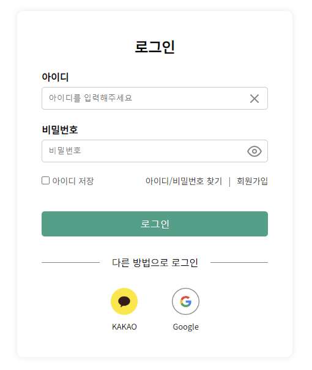

# 📱휴대폰 판매 사이트 "MZT"  

[프로젝트 정리 상세보기 Notion](https://mzt2023.notion.site/5231e891d67544bc94e6d5d0bd8ec067?v=dc8249b9d75d47768b8b886eb88c5073&pvs=4)


> 배포 URL : http://13.209.19.247:8081 <br>
> admin ID : admin <br>
> admin PW : !admin12

- header에 있는 사람 아이콘 클릭! <br>
→ user : 마이페이지 <br>
→ admin : 관리자 페이지

<br>

# 📚 목차

1. [프로젝트 소개](#-프로젝트-소개)
2. [제작기간 및 참여인원](#-제작기간-및-참여인원)
3. [기술스택](#-기술스택)
4. [ERD](#%EF%B8%8F-erd)
5. [화면구성 및 기능](#%EF%B8%8F-화면구성-및-기능)
6. [트러블 슈팅](#-트러블-슈팅)

<br>

# 📖 프로젝트 소개

"MZT"는 "MZ"와 "Telecom"의 조합으로, "MZT"는 현대적인 통신 기술과 세대를 반영하며, 이를 기반으로 혁신적인 서비스를 제공한다는 의미를 담고 있습니다.

최근까지 제 4의 이동통신사와 관련하여 많은 이야기들이 대두가 되었습니다. 현재도 제 4 이동통신사가 되기 위해 도전을 하고 있는 기업들을 볼 수 있는데, 이러한 상황들을 착안해서 프로젝트를 기획하게 되었습니다.

<br>

[목차🔺](#-목차)
<br><br>

# 👋🏻 제작기간 및 참여인원

### FrontEnd
2023-11-13 ~ 2023-12-10
### BackEnd
2023-12-18 ~ 2024-02-12
### 참여인원
팀 프로젝트 (총 3명)<br>

<table>
  <tr>
    <td align="center" width="180px">
      <a href="https://github.com/Si-Woo91" target="_blank">
        
      </a>
    </td>
    <td align="center" width="180px">
      <a href="https://github.com/Ji-Yoon98" target="_blank">
        
      </a>
    </td>
    <td align="center" width="180px">
      <a href="https://github.com/kiya-moon" target="_blank">
        
      </a>
    </td>
  </tr>
    
  <tr>
    <td align="center">
      <a href="https://github.com/Si-Woo91" target="_blank">
          김시우<br />
          BackEnd & 리더
      </a>
    </td>
    <td align="center">
      <a href="https://github.com/Ji-Yoon98" target="_blank">
        박지윤<br />
        BackEnd & FrontEnd
      </a>
    </td>
    <td align="center">
      <a href="https://github.com/kiya-moon" target="_blank">
        문기연<br />
        BackEnd
      </a>
    </td>
  </tr>
</table>

<br>

[목차🔺](#-목차)
<br><br>

# 🪛 기술스택

### Environment
&nbsp;
&nbsp;

&nbsp;

<br>

### FrontEnd
&nbsp;
&nbsp;
&nbsp;
&nbsp;


<br>

### BackEnd
&nbsp;
&nbsp;
&nbsp;
&nbsp;
<br>

<br>

[목차🔺](#-목차)


# ⚙️ ERD


<br>

[목차🔺](#-목차)
<br><br>

# 🖥️ 화면구성 및 기능

### ** User **

<table>
  <thead>
    <tr>
      <th style="text-align: center;">회원가입</th>
      <th style="text-align: center;">회원 항목 입력</th>
      <th style="text-align: center;">이메일 인증</th>
    </tr>
  </thead>
  <tbody>
    <tr>
      <td align="center">
        <a href="imges/signup.png" target="_blank">
          
        </a>
      </td>
      <td align="center">
        <a href="imges/signupSave.png" target="_blank">
          
          </a>
      </td>
      <td align="center">
        <a href="imges/email.png" target="_blank">
        </a>
      </td>
    </tr>
  </tbody>
</table>


- 회원가입

  - **사용자 정보 수집 및 유효성 검사**: 사용자로부터 필요한 정보를 입력받고, 이메일 형식, 비밀번호 강도 등을 확인하여 유효한 데이터인지 검증.
  - **중복 확인**: 이미 등록된 사용자인지 확인하기 위해 이메일 주소 등의 고유한 정보를 기준으로 중복 여부를 확인
  - **비밀번호 암호화 및 안전한 저장**: Spring Security의 암호화 기능을 이용하여 사용자의 비밀번호를 안전하게 해시화하고, 안전한 방식으로 데이터베이스에 저장.

  </br></br>

<table>
  <thead>
    <tr>
      <th style="text-align: center;">로그인</th>
      <th style="text-align: center;">아이디 찾기</th>
      <th style="text-align: center;">비밀번호 찾기</th>
    </tr>
  </thead>
  <tbody>
    <tr>
      <td align="center">
        <a href="imges/login.png" target="_blank">
          
        </a>
      </td>
      <td align="center">
        <a href="imges/id.gif" target="_blank">
          
        </a>
      </td>
      <td align="center">
        <a href="imges/pw.gif" target="_blank">
          
          </a>
      </td>
    </tr>
  </tbody>
</table>


- 로그인
  - **인증 프로세스 구현**: Spring Security를 사용하여 사용자가 제공한 인증 정보(일반적으로 아이디와 비밀번호)를 검증, 이를 통해 사용자가 시스템에 접근 가능한지 확인
  - **비밀번호 해싱 및 매칭**: 사용자가 제공한 비밀번호를 Spring Security의 암호화 기능을 활용하여 저장된 해시된 비밀번호와 비교
  - **인가 및 권한 부여**: Spring Security를 사용하여 특정한 권한이 필요한 경우, 해당 권한을 가진 사용자만이 특정 기능 또는 페이지에 접근할 수 있도록 제어
  - **보안 강화 및 로그인 관련 설정**: CSRF(Cross-Site Request Forgery) 공격 등에 대비하기 위한 설정 및 보안 강화를 위한 다양한 옵션들을 활용하여 로그인 시스템을 안전하게 구성

  </br>

- 아이디 찾기
  - **이름, 생년월일, 이메일 주소 입력**: 사용자가 등록한 이름, 생년월일, 이메일 주소를 입력
  - **검증 및 일치 여부 확인**: 입력된 값들이 데이터베이스에 등록되어 있는지 확인 등록된 값이라면 해당하는 아이디를 사용자에게 모달창으로 알려줌.

- 비밀번호 재설정(비밀번호 찾기)
  - **아이디, 생년월일, 이메일 주소** : 사용자가 등록한 아이디, 생년월일, 이메일 주소를 통해 신원을 확인
  - **신원 확인 후 비밀번호 재설정**: 신원 확인이 성공하면, 비밀번호를 재설정 하여 사용자 이메일로 전송, 해당 비밀번호는 암호화 후 데이터베이스에 저장
  - **안내 및 완료**: 비밀번호가 성공적으로 변경되었음을 사용자에게 안내하고, 로그인할 수 있는 새로운 정보를 제공

  <br>

### ** Product **

<table>
  <thead>
    <tr>
      <th style="text-align: center;">상품 페이지</th>
      <th style="text-align: center;">상품 상세페이지</th>
      <th style="text-align: center;">장바구니 버튼</th>
      <th style="text-align: center;">장바구니</th>
    </tr>
  </thead>
  <tbody>
    <tr>
      <td align="center">
        <a href="imges/product.png" target="_blank">
          
        </a>
      </td>
      <td align="center">
        <a href="imges/productDetail.png" target="_blank">
          
        </a>
      </td>
      <td align="center">
        <a href="imges/cartBtn.gif" target="_blank">
          
          </a>
      </td>
      <td align="center">
        <a href="imges/cart.png" target="_blank">
          
          </a>
      </td>
    </tr>
  </tbody>
</table>

- 상품 페이지
  - **상품 카테고리 별 조회:** 사용자가 원하는 카테고리로 상품을 정렬하여 쉽게 볼 수 있도록 기능을 추가.
  - **상품 페이징 처리:** 상품 목록이 많은 경우 한 번에 모든 상품을 보여주기 어려울 수 있으므로 페이징 처리를 통해 보여지는 상품의 개수를 제한하고 나누어 보여줌.

  </br>

- 상품 상세 페이지
  - **상품 옵션 설정**: 상품의 다양한 옵션을 설정할 수 있는 기능 추가. 색상, 기가 등 옵션을 선택할 수 있도록 함.
  - **상품 찜하기 :** 로그인을 한 고객이 찜하기 버튼을 클릭 시 하트가 빨간색으로 변경이 됨. 로그인을 안하고 찜하기 버튼을 클릭 시 로그인이 필요하다는 메시지를 노출.
  - **찜하기 취소 :** 기존에 찜하기를 한 상품에서 찜하기 버튼을 클릭시 빨간 하트가 비어 있는 하트로 변경된다.
  - **장바구니에 상품 담기**: "장바구니" 버튼을 클릭하면 해당 상품이 장바구니에 담김. 같은 상품을 다시 담으면 "이미 담긴 상품입니다" 메세지 출력.
  - **장바구니 조회**: 사용자가 자신의 장바구니에 담긴 상품 목록을 조회 하는 기능을 구현. 어떤 상품이 장바구니에 담겨 있는지 확인 가능.
  - **장바구니에 담긴 상품 삭제**: 사용자가 장바구니에 담긴 특정 상품을 삭제할 수 있는 기능 추가. 장바구니 페이지에서 각 상품 오른쪽에 있는 “X" 버튼을 클릭하면 해당 상품이 장바구니에서 삭제됨.

  </br>

### ** Order, Payment **

<table>
  <thead>
    <tr>
      <th style="text-align: center;">본인 인증</th>
      <th style="text-align: center;">간편 인증</th>
      <th style="text-align: center;">주문 내역</th>
      <th style="text-align: center;">간편 결제</th>
    </tr>
  </thead>
  <tbody>
    <tr>
      <td align="center">
        <a href="imges/authentication.png" target="_blank">
          
          </a>
      </td>
      <td align="center">
        <a href="imges/popup.png" target="_blank">
          
        </a>
      </td>
      <td align="center">
        <a href="imges/order.png" target="_blank">
          
          </a>
      </td>
      <td align="center">
        <a href="imges/payment.png" target="_blank">
          
        </a>
      </td>
    </tr>
  </tbody>
</table>

- 본인 인증
  - **사용자 주소 업데이트(카카오 API):** 사용자가 주소를 업데이트할 때 카카오 API를 활용하여 정확한 주소 정보를 입력함. 카카오 API를 통해 주소 검색 기능을 제공하여 사용자가 편리하게 주소를 입력하고 업데이트 함.
  - **본인 인증(포트원 API):** 사용자의 본인을 인증하기 위해 포트원 API를 활용. 사용자가 상품 결제 기능을 이용할 때 본인 인증 절차를 거치도록 함.

- 결제
  - **결제(포트원 API):** 사용자가 상품을 구매할 때 포트원 API를 활용하여 카카오 간편 결제 기능을 제공하고 주소 변경도 가능하게 설정. 사용자가 원하는 상품을 쉽고 편리하게 구매할 수 있음. 

</br>

### ** Review **

<table>
  <thead>
    <tr>
      <th style="text-align: center;">구매 후기</th>
      <th style="text-align: center;">구매 후기 상세</th>
    </tr>
  </thead>
  <tbody>
    <tr>
      <td align="center">
        <a href="imges/board.gif" target="_blank">
          
        </a>
      </td>
      <td align="center">
        <a href="imges/board_view.gif" target="_blank">
          
        </a>
      </td>
    </tr>
  </tbody>
</table>

- 구매 후기
  - **구매 후기 메인:** 고객이 작성한 구매 후기 내용을 게시판 형태로 조회. 페이지 당 5개의 목록을 보여주고 다음 페이지로 이동 할 수 있도록 페이징 처리가 되어 있음.
  - **구매 후기 상세**: 본인 또는 타인이 작성한 구매 후기를 볼 수 있음. 작성자 본인은 수정, 삭제를 할 수 있는 버튼이 추가적으로 생성.
  - **구매 후기 작성:** 로그인 한 고객이 구매한 상품에 대하여 후기를 작성 할 수 있음. 작성시 카테고리 선택과 글 제목, 내용을 필수로 입력을 해야 하고, 첨부파일로 이미지를 첨부할 수 있음. (로그인 하지 않았을 시 로그인을 하도록 로그인 페이지로 이동.)

- 구매 후기 상세
  - **구매 후기 검색 :** 글 목록 페이지에서 검색 시 제목 또는 작성자를 구분하여 검색 할 수 있도록 함. 검색 시 입력한 문자가 일부라도 있으면 목록을 보여줌.
  - **구매 후기 수정 :** 고객 본인이 작성한 후기 내용을 수정하고 싶을 때 수정 할 수 있음. (글 제목, 글 내용, 첨부 파일 수정 가능)
  - **구매 후기 삭제 :** 고객 본인이 작성한 후기 내용을 삭제 할 수 있음. 삭제시 구매 후기 내용과 첨부파일 모두 DB에서 삭제, 첨부파일도 폴더에서 삭제.
  - **파일 업로드 :** 구매한 상품의 이미지를 첨부하거나 삭제, 수정을 할 수 있음. 


</br>

### ** 고객지원 **

<table>
  <thead>
    <tr>
      <th style="text-align: center;">FAQ</th>
      <th style="text-align: center;">QnA</th>
    </tr>
  </thead>
  <tbody>
    <tr>
      <td align="center">
        <a href="imges/FAQ.png" target="_blank">
          
        </a>
      </td>
      <td align="center">
        <a href="imges/QnA.png" target="_blank">
          
        </a>
      </td>
    </tr>
  </tbody>
</table>

- 고객 지원
  - **FAQ**: 자주 묻는 질문(FAQ) 페이지를 구현하여 사용자들이 자주 문의하는 내용에 대한 답변을 제공합니다. 이를 통해 사용자들이 자주 묻는 질문들을 쉽게 찾아볼 수 있고, 고객 서비스에 대한 효율성을 높일 수 있습니다.
  - **QnA**: 사용자들이 질문을 하고 답변을 받을 수 있는 공간을 마련합니다. 사용자들이 궁금한 사항을 질문하고 관리자가 그에 대한 답변을 제공함으로써 고객 서비스의 질을 향상시킵니다.

  </br>

### ** MyPage **

<table>
  <thead>
    <tr>
      <th style="text-align: center;">마이페이지 메인</th>
      <th style="text-align: center;">회원 정보</th>
      <th style="text-align: center;">주문 내역</th>
      <th style="text-align: center;">찜한 목록</th>
    </tr>
  </thead>
  <tbody>
    <tr>
      <td align="center">
        <a href="imges/myPage.png" target="_blank">
          
        </a>
      </td>
      <td align="center">
        <a href="imges/userUpdate.gif" target="_blank">
          
        </a>
      </td>
      <td align="center">
        <a href="imges/orderDetail.png" target="_blank">
          
        </a>
      </td>
      <td align="center">
        <a href="imges/wish.png" target="_blank">
          
        </a>
      </td>
    </tr>
  </tbody>
</table>

- 마이 페이지
  - **회원 정보 수정 :** 회원 정보 수정 탭을 클릭 시 로그인 한 회원의 정보를 보여준다. 비밀번호를 변경 하고 싶을 시 비밀번호 옆 수정 버튼을 클릭 시 비밀번호를 변경할 수 있음. 핸드폰 번호를 변경 하고 싶을 시 핸드폰 번호 옆 수정 버튼 클릭 시 핸드폰 번호를 변경 할 수 있음. 단, 소셜 로그인을 했을 경우는 비공개로 처리 되어 수정 할 수 없음.
  - **주문 내역 :**  주문 내역 탭을 클릭 시 고객이 주문한 내역을 볼 수 있음. 주문 내역에서는 주문 번호, 주문 일자, 구매한 상품 명, 상품의 가격, 배송 상태를 볼 수 있음. 주문 내역 없을 시 빈 화면 노출.
  - **찜한 상품 조회 :** 찜한 상품 탭 클릭 시 고객이 찜한 상품 목록을 보여줌. 찜한 상품이 없을 때는 빈 화면이 노출.


 </br>

### ** Admin **

<table>
  <thead>
    <tr>
      <th style="text-align: center;">회원 관리</th>
      <th style="text-align: center;">상품 관리</th>
      <th style="text-align: center;">QnA</th>
      <th style="text-align: center;">주문 현황</th>
    </tr>
  </thead>
  <tbody>
    <tr>
      <td align="center">
        <a href="imges/admin_user.png" target="_blank">
          
        </a>
      </td>
      <td align="center">
        <a href="imges/admin_product.gif" target="_blank">
          
        </a>
      </td>
      <td align="center">
        <a href="imges/admin_qna.gif" target="_blank">
          
        </a>
      </td>
      <td align="center">
        <a href="imges/admin_order.png" target="_blank">
          
        </a>
      </td>
    </tr>
  </tbody>
</table>

- 회원 관리
  - **회원 조회:** 회원들의 이름, 아이디, 이메일, 생년월일, 핸드폰번호, 가입일을 조회해오는 기능. 10개씩 조회 되도록 페이징 처리되어 있으며, 회원 이름으로 검색 가능
  - **회원 삭제:** 선택한 회원을 삭제하는 기능. 여러 명을 한 번에 삭제 가능

- 상품 관리
  - **상품 추가:** 새 상품을 추가할 수 있는 기능을 구현. 상품의 이름, 가격, 설명, 이미지 등의 정보를 입력하여 새로운 상품을 등록.
  - **상품 수정:** 등록된 상품의 정보를 수정, 상품의 가격이나 이미지 등을 변경하여 상품을 업데이트.
  - **상품 삭제:** 등록된 상품을 삭제. 더 이상 판매되지 않는 상품이나 더 이상 유효하지 않은 상품을 삭제하여 상품 목록을 정리.

- QnA
  - **문의 조회 :** 문의 내역이 있을 경우 문의 분류, 답변 받을 이메일 주소를 보여줌.
문의 내역을 클릭 시  문의 내용과 분류, 답변 받을 이메일이 노출 됨.
  - **문의 답장 :** 문의 내용을 확인 후 관리자 이메일로 답변을 보낸 후, 답변 완료 버튼을 클릭 시 문의 내역이 삭제가 되어짐.

- 주문 현황
  - **배송 상태 변경**: ‘배송 전’, ‘배송 중’, ‘배송완료’로 상태를 구분하고 상태에 따라 배송 상태를 변경할 수 있는 ‘배송 중’, ‘배송완료’ 버튼 노출.

<br>

[목차🔺](#-목차)
<br><br>


# ✅ 트러블 슈팅

<details>

<summary>Security 소셜 로그인</summary>
<br>

Security 소셜 로그인을 통한 회원가입 시에는 기본 회원가입 필드에 대한 제약 조건 (NotNull, unique)과 충돌 발생

```java
@Transactional
public CustBas whenSocialLogin(String providerTypeCode, String custId, String custNm, String custEmail) {
	Optional<CustBas> opCustBas = findByCustId(custId);
		
	// 존재하는 고객인 경우, 해당 고객 정보 반환
	if (opCustBas.isPresent()) { return opCustBas.get(); }
		
	// 새로운 고객 등록을 위해 고객 정보 설정
	CustBasDTO request = new CustBasDTO();
	request.setCustId(custId);
	// 소셜 로그인를 통한 가입시 비번 X
	  request.setCustPassword("");
	  request.setCustNm(custNm);
	  request.setCustEmail(custEmail);
	  request.setCustNo("Unknown");
	  
	  String uniqueIdfyNo = UUID.randomUUID().toString();
	  request.setCustIdfyNo(uniqueIdfyNo);
	       
	  return save(request);
}
```

- 소셜 로그인을 통한 가입시 비밀번호를 빈 문자열로 설정하여 NotNull 제약 조건 충족
- 고객 번호 설정 ("Unknown"으로 임시 설정)
- 고유 식별 번호(UUID)를 생성하여 이를 고객의 ID로 설정함으로써 유니크 제약 조건 충돌을 해결

</br></br>  

</details>

<details>

<summary>데이터 바인딩 이슈</summary>
<br>

@ModelAttribute 사용시 데이터 바인딩이 되지 않는 현상 발생

- js에서 formData로 data를 전송할 시 @ModelAttribute DTD에 바인딩이 되지 않아 DTO에 값이 null 로 출력.

```java
@PostMapping(value="/purRevView/{id}")
public String updatePurRev(Model model, @PathVariable Long id
							, @ModelAttribute PurRevBoardDTO inPurRevBoardDTO 
							, @RequestPart(value = "files", required = false) List<MultipartFile> files) {
		
	logger.debug("purRevBoardDTO :: " + StringUtil.toString(inPurRevBoardDTO));
		
	if(Utiles.isNullOrEmpty(files)) {
		files = Collections.emptyList();
	}
		
	// 게시글 업데이트
	purRevBoardService.purRevUpdate(id, inPurRevBoardDTO, files);
		
	// 임시저장 초기화
	temporarySaveDTO.clear();
		
	return "redirect:/purRevBoard";
}
```

- DTO에서 @Setter를 추가
- @NoArgsConstructor를 사용시 @Setter가 없으면 바인딩이 되지 않아 @Setter를 꼭 같이 사용해줘야 한다.

</br>

> @ModelAttribute는 생성자가 1개면 그 생성자를 통해 객체를 생성하고, </br>
> 생성자가 2개 > 이상이면 매개변수 없는 생성자를 통해 객체를 생성하고 Setter로 값을 세팅하여야 한다.</br>
> AllArgsConstructor : 모든 필드 값을 파라미터로 받는 생성자를 만듦 </br>
> NoArgsConstructor  : 파라미터가 없는 기본 생성자를 생성


</br></br>  

</details>

<details>

<summary>Foreign key 제약조건 이슈</summary>
<br>

관리자 페이지의 회원관리에서 회원삭제 시, 구매 이력이 있는 회원의 경우 외래키 제약조건 오류로 삭제 되지 않는 오류 발생.
> Cannot delete or update a parent row: a foreign key constraint fails (`mzt`.`orders`, CONSTRAINT `FKhha00abakf1ylafopwl6xx9sp` FOREIGN KEY (`cust_bas_id`) REFERENCES `cust_bas` (`id`))

```java
	public void deleteCust(List<Long> custIds) {
		logger.debug("회원삭제 서비스 도착 :: " + custIds);
			
		for (Long id : custIds) {
			CustBas custBas = new CustBas(id);
	        try {
	            orderRepository.deleteByCustBas(custBas);
	        } catch (Exception e) {
	            logger.error("orders 삭제 실패", e);
	        }
			logger.debug("orders 삭제 완료");
            adminRepository.deleteById(id);
            logger.debug("custBas 삭제 완료");
        }	
	}
```

- JPA Cascade 중 CascadeType.REMOVE를 사용하여 삭제하는 것을 고려하였으나,</br>  
  추후 기능 확장 시 Orders 테이블에 연관 테이블이 추가로 매핑될 경우 참조 무결성 제약조건 위반 가능성이 있을 것을 우려하여</br>  
  Orders 테이블에서 먼저 해당 회원과 관련된 데이터를 삭제 후 회원 테이블에서 해당 회원을 삭제하도록 코딩</br>

</br></br>

</details>

<br>

[목차🔺](#-목차)


